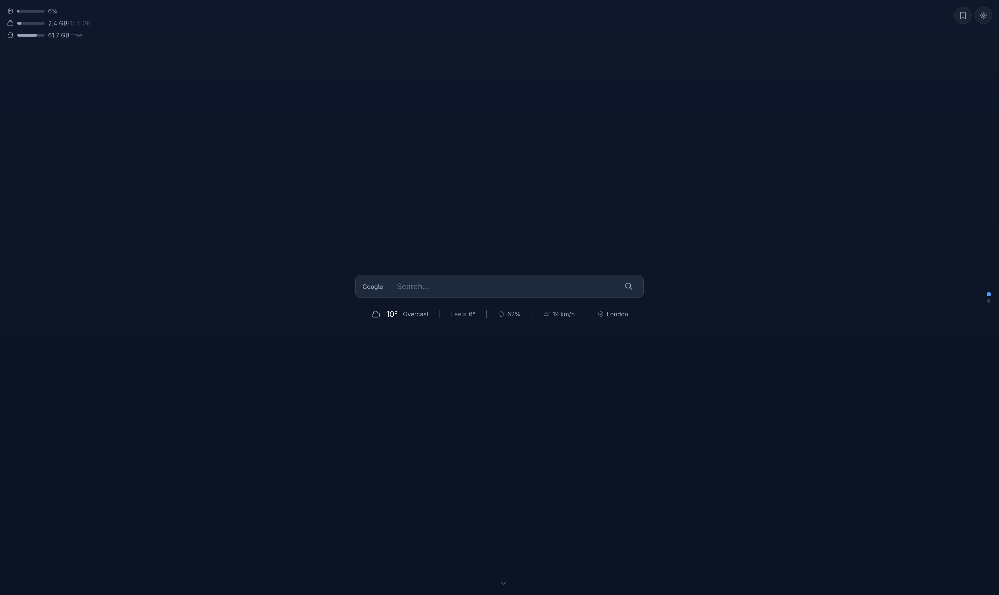
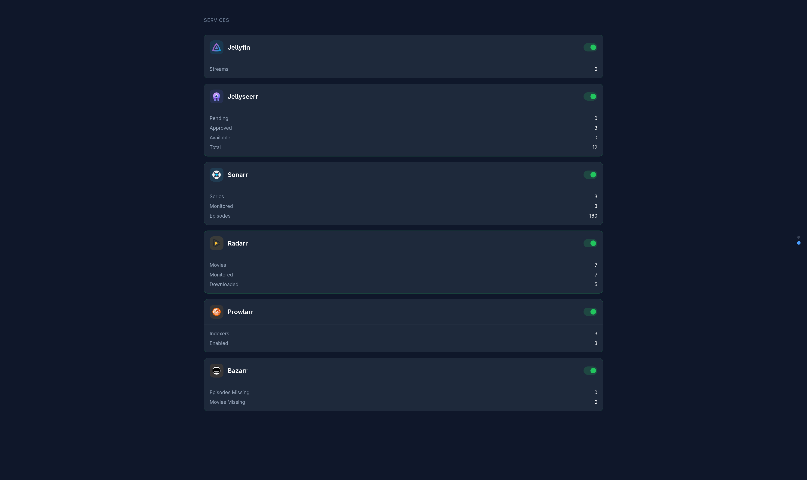

# Homedash

A self-hosted home dashboard for your homelab. Shows system stats, weather, and live widgets for your services — Sonarr, Radarr, Prowlarr, Jellyfin, Jellyseerr and more.




## Features

- **Auto-discovery** — detects services running in Docker, extracts API keys automatically
- **Live updates** — service stats refresh in the background without page reloads
- **System stats** — CPU, memory and disk usage
- **Weather** — free via Open-Meteo, no API key required
- **Search** — quick-launch bar with configurable engines
- **Bookmarks** — managed from the settings panel in the UI
- **Container control** — start/stop containers directly from the dashboard

---

## Quick start

```bash
# 1. Clone the repo
git clone https://github.com/jestemleonard/homedash.git
cd homedash

# 2. Edit docker-compose.yml — set your hostname and any API keys

# 3. Start it
docker compose up -d --build

# 4. Open http://your-server:8080
```

---

## Configuration

Everything is configured through environment variables in `docker-compose.yml`. No other files need to be edited.

### Server

| Variable | Default | Description |
|---|---|---|
| `HOMEDASH_HOSTNAME` | _(empty)_ | **Required.** The LAN IP or hostname of the machine running homedash (e.g. `192.168.0.100`). This is used to construct service URLs and make dashboard links reachable from your browser. Auto-discovered services will not work without it. |
| `HOMEDASH_PORT` | `8080` | Port homedash listens on. |

### Pages

| Variable | Default | Description |
|---|---|---|
| `HOMEDASH_HOME_PAGE` | `true` | Set to `false` to skip the search/weather page and land directly on services. |

### Weather

Weather is enabled by default. Uses [Open-Meteo](https://open-meteo.com/) which is free and requires no API key.

| Variable | Default | Description |
|---|---|---|
| `HOMEDASH_WEATHER_ENABLED` | `true` | Enable weather widget. |
| `HOMEDASH_WEATHER_LOCATION` | `London` | City name for weather lookup. |
| `HOMEDASH_WEATHER_UNITS` | `metric` | `metric` (°C, km/h) or `imperial` (°F, mph). |
| `HOMEDASH_WEATHER_PROVIDER` | `openmeteo` | `openmeteo` (free) or `openweathermap`. |
| `HOMEDASH_WEATHER_API_KEY` | _(empty)_ | Required only for `openweathermap`. |

### Services

When running in Docker, service URLs default to `http://HOMEDASH_HOSTNAME:PORT` (e.g. `http://192.168.0.100:8989` for Sonarr). You only need to set `_URL` if the service is **not** running in Docker.

Each service also supports an `_EXTERNAL_URL` variable — this is the clickable link shown in the dashboard. Useful when you access services through a reverse proxy (e.g. `http://sonarr.home`). If not set, it falls back to the service URL.

#### Auto-discovered services

Sonarr, Radarr, Prowlarr and Bazarr are **fully auto-discovered** when running in Docker — homedash finds the containers, determines their URLs, and extracts their API keys from their config files. You don't need to set anything for these.

| Variable | Description |
|---|---|
| `HOMEDASH_SONARR_URL` | Sonarr URL (only if not using Docker) |
| `HOMEDASH_SONARR_API_KEY` | Sonarr API key override |
| `HOMEDASH_SONARR_EXTERNAL_URL` | URL shown in the dashboard (e.g. `http://sonarr.home`) |
| `HOMEDASH_RADARR_URL` | Radarr URL (only if not using Docker) |
| `HOMEDASH_RADARR_API_KEY` | Radarr API key override |
| `HOMEDASH_RADARR_EXTERNAL_URL` | URL shown in the dashboard |
| `HOMEDASH_PROWLARR_URL` | Prowlarr URL (only if not using Docker) |
| `HOMEDASH_PROWLARR_API_KEY` | Prowlarr API key override |
| `HOMEDASH_PROWLARR_EXTERNAL_URL` | URL shown in the dashboard |
| `HOMEDASH_BAZARR_URL` | Bazarr URL (only if not using Docker) |
| `HOMEDASH_BAZARR_API_KEY` | Bazarr API key override |
| `HOMEDASH_BAZARR_EXTERNAL_URL` | URL shown in the dashboard |

#### Services requiring manual API keys

Jellyfin, Jellyseerr and Plex can be discovered by container, but their API keys are stored in a database and must be provided manually.

**Where to find your API key:**
- **Jellyfin**: Dashboard → API Keys → `+` New API Key
- **Jellyseerr**: Settings → General → API Key
- **Plex**: [Finding an authentication token](https://support.plex.tv/articles/204059436-finding-an-authentication-token-x-plex-token/)

| Variable | Description |
|---|---|
| `HOMEDASH_JELLYFIN_API_KEY` | Jellyfin API key _(required for widget)_ |
| `HOMEDASH_JELLYFIN_URL` | Jellyfin URL (only if not using Docker) |
| `HOMEDASH_JELLYFIN_EXTERNAL_URL` | URL shown in the dashboard |
| `HOMEDASH_JELLYSEERR_API_KEY` | Jellyseerr API key _(required for widget)_ |
| `HOMEDASH_JELLYSEERR_URL` | Jellyseerr URL (only if not using Docker) |
| `HOMEDASH_JELLYSEERR_EXTERNAL_URL` | URL shown in the dashboard |
| `HOMEDASH_PLEX_API_KEY` | Plex token _(required for widget)_ |
| `HOMEDASH_PLEX_URL` | Plex URL (only if not using Docker) |
| `HOMEDASH_PLEX_EXTERNAL_URL` | URL shown in the dashboard |

### Theme

| Variable | Default | Description |
|---|---|---|
| `HOMEDASH_ACCENT_COLOR` | `#4a9eff` | Accent colour (buttons, highlights). |
| `HOMEDASH_PRIMARY_COLOR` | `#1a1a2e` | Primary background colour. |
| `HOMEDASH_BACKGROUND_TYPE` | `solid` | `solid` or `image`. |
| `HOMEDASH_BACKGROUND_URL` | _(empty)_ | URL to a background image (when type is `image`). |

---

## How auto-discovery works

When homedash starts, it connects to the Docker socket (`/var/run/docker.sock`) and scans running containers. For each container whose image matches a known integration, it:

1. Determines the service URL from the container's port bindings and your configured `HOMEDASH_HOSTNAME`
2. Reads the service's config file from inside the container to extract the API key
3. Starts polling the service API on a background timer and caching the results

If you also provide a `HOMEDASH_*_URL` for a service, that takes full priority over what was discovered. If you provide only a `HOMEDASH_*_API_KEY` with no URL, the discovered URL is kept and only the key is overridden — this is the intended setup for Jellyfin and Jellyseerr.

---

## Advanced configuration

For things not covered by environment variables (custom search engines, bookmarks, adding new service integrations), you can mount your own `config.yaml`:

```yaml
volumes:
  - /var/run/docker.sock:/var/run/docker.sock:ro
  - ./my-config.yaml:/app/config.yaml:ro
```

You can still use `${VAR:-default}` syntax inside your own config file.

---

## Customization

### Template and static file overrides

You can override any template or static file by placing your version in `overrides/` or `custom/` directories (mounted as volumes). Homedash checks these directories first before falling back to the defaults:

- **Templates**: `overrides/templates/` or `custom/templates/` — override layout, pages, or individual components
- **Static files**: `overrides/static/` or `custom/static/` — override CSS, JS, or images
- **Custom CSS**: Place a `custom.css` in `overrides/static/css/` or `custom/static/css/` and it will be automatically included

For example, to override the service group component:

```yaml
volumes:
  - ./my-templates/components/service-group.html:/app/overrides/templates/components/service-group.html:ro
```

### JSON API

Homedash exposes a JSON API that you can use to build a completely custom frontend:

| Endpoint | Description |
|---|---|
| `GET /api/system` | System stats (CPU, memory, disks) |
| `GET /api/weather` | Weather data |
| `GET /api/widgets` | All service widgets with current data |

---

## Adding or modifying integrations

Integrations are YAML files in the [`integrations/`](integrations/) directory — no Go code changes needed. See the **[Integration Guide](integrations/README.md)** for the full file structure, data extraction reference, and step-by-step instructions for adding new services.

---

## Development

```bash
# Build binary
go build -o homedash ./cmd/homedash/

# Build Docker image
docker build -t homedash .
```

Requirements: Go 1.24+
